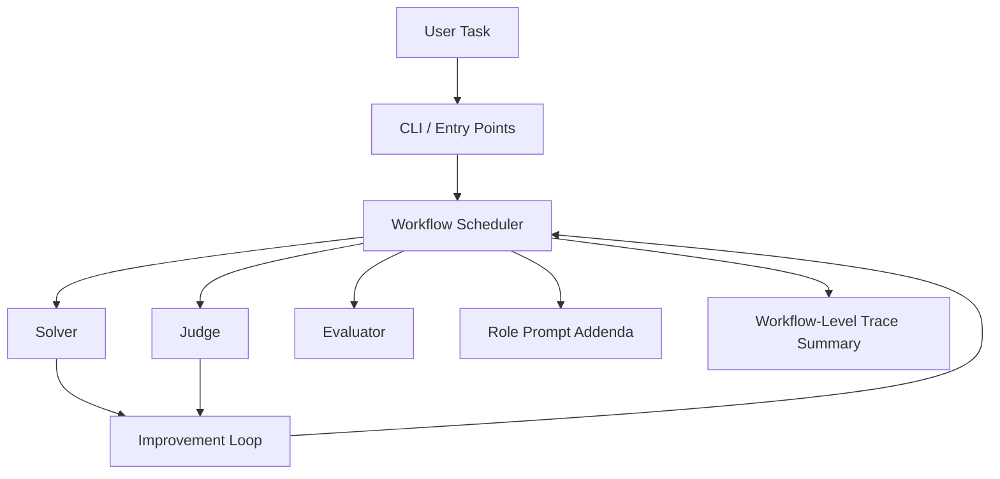
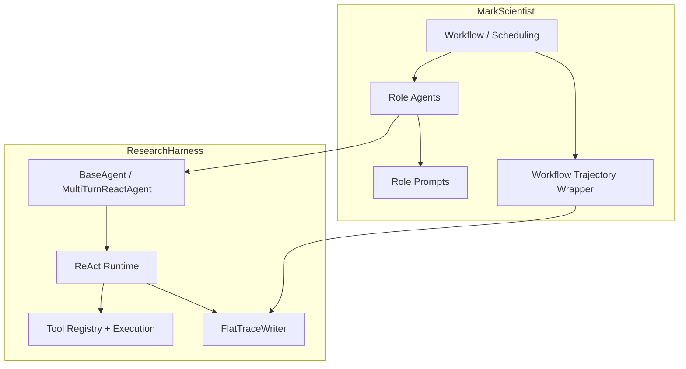

<div align="center">

# 🔬 MarkScientist

**A multi-agent scientific workflow layer built on top of ResearchHarness, with Solver, Judge, Evaluator roles and review-driven improvement loops.**

[](LICENSE)
[](https://www.python.org/)
[](https://github.com/black-yt/ResearchHarness)
[](#-how-it-works)
[](#-how-it-works)
[](#-architecture-boundary)

</div>

MarkScientist is a higher-layer framework for running **role-specialized agents**, **review-driven improvement loops**, and **workflow-level evaluation** on top of ResearchHarness.

Unlike a standalone execution harness, this project is intentionally centered on:

- Solver, Judge, and Evaluator role separation
- iterative review and improvement loops
- workflow-level traces layered on top of per-agent harness traces
- higher-level orchestration and evaluation policies
- a CLI that exposes system behavior across multiple agents

The point is not to replace ResearchHarness. The point is to build a **multi-agent scientific workflow layer** that reuses the lower-layer runtime while adding role structure, review pressure, and orchestration logic.

---

## 📚 Table of Contents

- [✨ Highlights](#-highlights)
- [⚡ Quick Start](#-quick-start)
- [🧠 How It Works](#-how-it-works)
- [🧭 Architecture Boundary](#-architecture-boundary)
- [💬 Usage](#-usage)
- [🐾 Reviewer Buddies](#-reviewer-buddies)
- [📋 Commands](#-commands)
- [🎯 Task Types](#-task-types)
- [⚙️ Config](#️-config)
- [🗺️ Roadmap](#️-roadmap)
- [🪪 License](#-license)

---

## ✨ Highlights

- **Built on ResearchHarness**
  ResearchHarness owns SDK calls, tool calling, and the ReAct loop; MarkScientist owns multi-agent roles and workflow orchestration.
- **Three-agent workflow**
  Solver executes, Judge reviews, and Evaluator inspects system-level behavior.
- **Review-driven improvement**
  The workflow can iteratively improve outputs based on Judge feedback instead of stopping at one draft.
- **Workflow-level traces**
  MarkScientist preserves per-agent ResearchHarness traces and adds a higher-level workflow summary.
- **Task-aware review**
  Judge supports multiple task types with task-appropriate scoring dimensions.
- **Reviewer buddies**
  The CLI includes lightweight reviewer personas for more readable interactive evaluation.

### At a Glance

| Area | What MarkScientist focuses on |
| --- | --- |
| Runtime dependency | Reuses ResearchHarness for execution |
| Roles | Solver, Judge, Evaluator |
| Review model | Score, critique, and improve |
| Trace model | Workflow summary plus per-agent traces |
| UX | Interactive multi-agent CLI |
| Scope | Orchestration layer, not execution harness |

## 🚀 Quick Start

```bash
git submodule update --init --recursive
pip install -e .
markscientist
```

`MarkScientist` currently assumes a source checkout with the `ResearchHarness` git submodule available. Wheel-only installs are not a supported standalone distribution mode unless you point `RESEARCHHARNESS_PATH` at an external checkout.

## 🧠 How It Works

`MarkScientist` is not a second execution harness. It is a higher-layer framework built on top of `ResearchHarness`.



The lower-layer execution details live in `ResearchHarness`, and `MarkScientist` connects to them like this:



## 🧭 Architecture Boundary

- `ResearchHarness` is the execution layer:
  - OpenAI-compatible SDK calls
  - native tool calling
  - ReAct loop
  - tool registry and execution
  - flat per-agent trace writing
- `MarkScientist` is the orchestration layer:
  - Solver / Judge / Evaluator agent roles
  - workflow scheduling and improvement loops
  - role-specific prompt addenda
  - workflow-level trajectory summaries

`MarkScientist` agents inherit the ResearchHarness agent base instead of reimplementing the lower-layer execution stack.

## 💬 Usage

### Interactive REPL

```bash
markscientist          # Start REPL (Solver + auto Judge review)
```

### 1. Solver Mode (Default, with Auto-Review)

```
[solver+judge] > What is the transformer architecture?

╭──────────────── Solver Output ────────────────╮
│ The Transformer was proposed in "Attention   │
│ Is All You Need" by Vaswani et al. in 2017...│
╰──────────────────────────────────────────────╯

((•)(•)) =•ω•= [•=•] /• •\ Summoning reviewer...

[•=•] EVAL-9000 appears! "Computing evaluation scores..."

╭─────────── The Objective Analyzer ───────────╮
│  Reaction   ✓ Excellent!                     │
│  Type       factual_query                    │
│  Score      8.5/10                           │
╰──────────────────────────────────────────────╯
```

### 2. Judge Mode (Review Artifacts)

```
[solver+judge] > /judge

[judge] > Review this code:
def fib(n): return fib(n-1)+fib(n-2) if n>1 else n

╭──────────────── Judge Review ─────────────────╮
│  Type       code_analysis                     │
│  Score      5.5/10                            │
│  Details    correctness: 7.0 | efficiency: 3.0│
│  Issues     No memoization; O(2^n) complexity │
╰───────────────────────────────────────────────╯
```

### 3. Evaluator Mode (Meta-Evaluation)

Evaluates the performance of Solver and Judge themselves.

```
[judge] > /evaluator

[evaluator] > Evaluate the system's performance on the last task

╭────────────── Meta Evaluation ────────────────╮
│  Solver Assessment                            │
│    task_completion: 0.85                      │
│    efficiency: 0.70                           │
│    reasoning_quality: 0.80                    │
│                                               │
│  Judge Assessment                             │
│    scoring_accuracy: 0.90                     │
│    issue_coverage: 0.75                       │
│    suggestion_actionability: 0.80             │
│                                               │
│  System Insights                              │
│    bottleneck: Solver lacks systematic testing│
│    suggestion: Add auto test case generation  │
│                                               │
│  Success Probability: 0.78                    │
╰───────────────────────────────────────────────╯
```

### 4. Workflow Mode (Full Pipeline)

Runs Solver → Judge → Auto-Improve loop until score >= 6.0

```
[solver+judge] > /workflow Write a literature review on RL for robotics

⠋ Running workflow...

╭──────────────── Final Output ─────────────────╮
│ # Literature Review: RL for Robotics          │
│ ## 1. Introduction ...                        │
│ ## 2. Key Methods ...                         │
╰───────────────────────────────────────────────╯

╭─────────── Workflow Complete ─────────────────╮
│  Status      Success                          │
│  Final Score 7.8/10                           │
│  Iterations  2                                │
│  Verdict     ACCEPT                           │
╰───────────────────────────────────────────────╯
```

### CLI One-Shot Commands

```bash
# Solver + Judge (default)
markscientist "Explain quicksort algorithm"

# Solver only (no auto-review)
markscientist "Explain quicksort" --no-review

# Judge only
markscientist "Review this code..." --agent judge

# Evaluator only
markscientist "Assess system performance" --agent evaluator

# Full workflow with improvement loop
markscientist "Write a research proposal" --workflow

# JSON output
markscientist "Analyze this data" --json
```

### Python API

```python
from pathlib import Path

from markscientist.config import Config, set_config

config = Config.from_env()
config.workspace_root = Path("./workspace")
set_config(config)

from markscientist.agents import EvaluatorAgent, JudgeAgent, SolverAgent

solver = SolverAgent(config=config)
result = solver.run("Implement binary search")
print(result.output)

judge = JudgeAgent(config=config)
review = judge.review(artifact=result.output, artifact_type="code_analysis")
print(f"Score: {review.overall_score}/10")
print(f"Issues: {review.weaknesses}")

evaluator = EvaluatorAgent(config=config)
meta = evaluator.evaluate(
    original_task="Implement binary search",
    solver_output=result.output,
    judge_review=review.raw_output,
)
print(f"Success Probability: {meta.success_probability}")
print(f"System Insights: {meta.system_insights}")
```

## 🐾 Reviewer Buddies

| Buddy | Name | Focus |
|:-----:|------|-------|
| `((•)(•))` | Professor Owl | Methodology |
| `=•ω•=` | Dr. Whiskers | Details |
| `[•=•]` | EVAL-9000 | Metrics |
| `<•~•>` | Elder Dragon | Big Picture |
| `/• •\` | The Specter | Hidden Issues |
| `~(••)~` | Dr. Tentacle | Multi-angle |

## 📋 Commands

```
/help       Show commands        /workflow   Full pipeline
/solver     Solver mode          /review     Toggle auto-review
/judge      Judge mode           /model      Switch model
/evaluator  Evaluator mode       /config     Show config
/clear      New session
```

## 🎯 Task Types

| Type | Scoring Dimensions |
|------|-------------------|
| `factual_query` | accuracy, completeness, clarity |
| `idea_proposal` | novelty, rigor, feasibility |
| `code_analysis` | correctness, depth, clarity |
| `literature_review` | coverage, synthesis, organization |
| `experiment_design` | methodology, validity, reproducibility |
| `writing_draft` | structure, clarity, coherence |
| `data_analysis` | accuracy, interpretation, visualization |
| `problem_solving` | correctness, efficiency, explanation |

## ⚙️ Config

```bash
# .env
API_KEY=your-key
API_BASE=https://your-openai-compatible-endpoint/v1
MODEL_NAME=gpt-5.4
RESEARCHHARNESS_PATH=./vendor/ResearchHarness
```

If you need a non-default `ResearchHarness` checkout programmatically, call `set_config(config)` before importing `markscientist.agents`.

## 🗺️ Roadmap

- [x] v0.1 — Three agents, multi-type Judge, Buddies
- [ ] v0.2 — Enhanced data collection
- [ ] v0.3 — Workflow optimization
- [ ] v1.0 — Stronger workflow policies, richer evaluation, better high-level testing

## 🪪 License

This project is released under the [MIT License](LICENSE).
