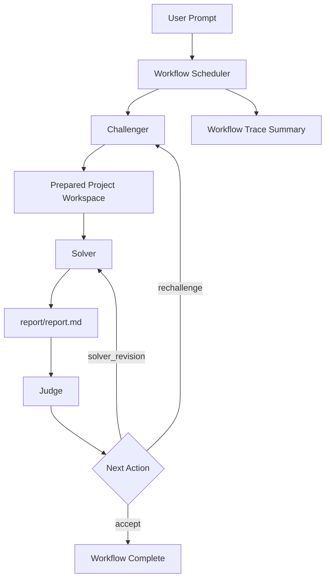
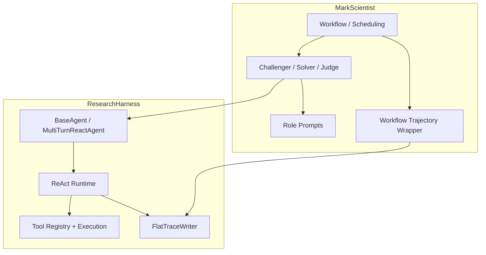

<div align="center">

# 🔬 MarkScientist

**Self-evolving Research Agent with Built-in Scientific Taste**

**Challenger prepares → Solver researches → Judge reviews**

[](LICENSE)
[](https://www.python.org/)
[](https://github.com/black-yt/ResearchHarness)
[](#-how-it-works)
[](#-how-it-works)
[](#-architecture-boundary)

</div>

MarkScientist is a higher-layer framework for turning a user request into a **research project workspace**, executing that project, and reviewing both the project definition and resulting report on top of ResearchHarness.

Unlike a standalone execution harness, this project is intentionally centered on:

- Challenger, Solver, and Judge role separation
- project-first research workflows
- review-driven improvement loops
- workflow-level traces layered on top of per-agent harness traces
- higher-level orchestration and evaluation policies
- a CLI that exposes the full research loop across multiple agents

The point is not to replace ResearchHarness. The point is to build a **scientific workflow layer** that reuses the lower-layer runtime while adding project setup, role structure, review pressure, and orchestration logic.

---

## 📚 Table of Contents

- [✨ Highlights](#-highlights)
- [⚡ Quick Start](#-quick-start)
- [🧠 How It Works](#-how-it-works)
- [🗂 Project Model](#-project-model)
- [🧭 Architecture Boundary](#-architecture-boundary)
- [💬 Usage](#-usage)
- [📋 Commands](#-commands)
- [⚙️ Config](#️-config)
- [🧪 Testing](#-testing)
- [🪪 License](#-license)

---

## ✨ Highlights

- **Built on ResearchHarness**
  ResearchHarness owns SDK calls, tool calling, and the ReAct loop; MarkScientist owns multi-agent roles and workflow orchestration.
- **Three-role research loop**
  Challenger prepares the project, Solver performs the research, and Judge scores both the project definition and the resulting report.
- **Project-first execution**
  The workflow is built around a concrete workspace with instructions, checklist, code, outputs, and `report/report.md`.
- **Review-driven improvement**
  The workflow can iteratively improve outputs based on Judge feedback instead of stopping at one draft.
- **Conditional re-challenge**
  Judge can send the workflow back to Challenger when the project definition itself is too weak, too toy-like, or not grounded in the available inputs, not just when the report is weak.
- **Workflow-level traces**
  MarkScientist preserves per-agent ResearchHarness traces and adds a higher-level workflow summary.
- **Checklist-based judging**
  Judge scores the project and report against an explicit challenge brief and checklist rather than vague style preferences.

### At a Glance

| Area | What MarkScientist focuses on |
| --- | --- |
| Runtime dependency | Reuses ResearchHarness for execution |
| Roles | Challenger, Solver, Judge |
| Core artifact | A prepared research project workspace |
| Review model | Score, critique, and improve the report |
| Trace model | Workflow summary plus per-agent traces |
| UX | Interactive multi-agent CLI |
| Scope | Scientific workflow layer, not execution harness |

## 🚀 Quick Start

```bash
git submodule update --init --recursive
pip install -e .
markscientist
```

`MarkScientist` currently assumes a source checkout with the `ResearchHarness` git submodule available. Wheel-only installs are not a supported standalone distribution mode.

## 🧠 How It Works

`MarkScientist` is not a second execution harness. It is a higher-layer framework built on top of `ResearchHarness`.



The lower-layer execution details live in `ResearchHarness`, and `MarkScientist` connects to them like this:



## 🗂 Project Model

The workflow now separates the Solver-visible execution workspace from Judge-only evaluation materials.

Expected layout:

```text
workspace_root/
  public/
    INSTRUCTIONS.md
    challenge/
      brief.md
      checklist.json
    data/
    related_work/
    code/
    outputs/
    report/
      report.md
      images/
  judge/
    notes.md            # optional judge-only guidance
    checklist.json      # optional judge-only rubric / hidden criteria
```

Role responsibilities:

- `Challenger` works only inside `public/` and prepares the Solver-visible project files.
- `Solver` works only inside `public/`, performs the research, and must finish with `public/report/report.md`.
- `Judge` evaluates the public deliverables and may additionally read `judge/` as hidden evaluation material.

This separation is intentional: hidden scoring criteria or target answers should never be exposed through the public project files that the Solver can read.

## 🧭 Architecture Boundary

- `ResearchHarness` is the execution layer:
  - OpenAI-compatible SDK calls
  - native tool calling
  - ReAct loop
  - tool registry and execution
  - flat per-agent trace writing
- `MarkScientist` is the orchestration layer:
  - Challenger / Solver / Judge roles
  - project preparation and workflow scheduling
  - solver/judge improvement loops
  - role-specific prompt addenda
  - workflow-level trajectory summaries

`MarkScientist` agents inherit the ResearchHarness agent base instead of reimplementing the lower-layer execution stack.

## 💬 Usage

### Interactive REPL

```bash
markscientist
```

Default mode runs the full research workflow.

```
[workflow] > Analyze the attached dataset and produce a research report.

╭──────────────── Final Report ────────────────╮
│ # Research Report                            │
│ ...                                          │
╰──────────────────────────────────────────────╯

╭──────────── Workflow Summary ────────────────╮
│ Status      Success                          │
│ Score       75.0/100                        │
│ Iterations  2                                │
╰──────────────────────────────────────────────╯
```

Switch to a single role when needed:

```
[workflow] > /challenger
[challenger] > Prepare a project for reproducing the core claim.

[challenger] > /solver
[solver] > Execute the prepared project and write the report.

[solver] > /judge
[judge] > Score the current report against the project checklist.
```

### CLI One-Shot Commands

```bash
# Full Challenger -> Solver -> Judge workflow
markscientist "Study whether the benchmark result is reproducible"

# Challenger only
markscientist "Prepare a project for evaluating the dataset" --agent challenger

# Solver only
markscientist "Execute the prepared project" --agent solver

# Judge only
markscientist "Review the current report" --agent judge

# JSON output
markscientist "Review the current report" --agent judge --json
```

### Python API

```python
from pathlib import Path

from markscientist.config import Config, set_config
from markscientist.project import ensure_project_layout

config = Config.from_env()
config.workspace_root = Path("./workspace")
set_config(config)

from markscientist.agents import ChallengerAgent, JudgeAgent, SolverAgent
from markscientist.workflow import ResearchWorkflow

paths = ensure_project_layout(config.workspace_root)

challenger = ChallengerAgent(config=config, workspace_root=paths.public_root)
challenger.run("Prepare a research project for the current prompt.", workspace_root=paths.public_root)

solver = SolverAgent(config=config, workspace_root=paths.public_root)
solver_result = solver.run("Execute the prepared project.", workspace_root=paths.public_root)

judge = JudgeAgent(config=config, workspace_root=paths.project_root)
judge_result = judge.run("Review the current report strictly.", workspace_root=paths.project_root)

workflow = ResearchWorkflow(config=config)
workflow_result = workflow.run("Write a research report", workspace_root=config.workspace_root)
print(workflow_result.final_score)
print(workflow_result.metadata["report_path"])
```

## 📋 Commands

```
/help        Show commands       /workflow    Full workflow
/challenger  Challenger mode     /solver      Solver mode
/judge       Judge mode          /model       Switch model
/config      Show config         /clear       New session
/exit        Exit
```

## ⚙️ Config

```bash
# .env
API_KEY=your-key
API_BASE=https://your-openai-compatible-endpoint/v1
MODEL_NAME=gpt-5.4
# SUMMARY_MODEL_NAME=gpt-5.4
SERPER_KEY_ID=your_serper_key
JINA_API_KEYS=your_jina_key
MINERU_TOKEN=your_mineru_token
```

`MarkScientist` reads `API_KEY`, `API_BASE`, and `MODEL_NAME` directly. The extra keys are included because the underlying `ResearchHarness` tool layer may need them when the workflow uses web search, web fetch, or PDF parsing.

Agent runtime defaults and trajectory defaults live in code. Override them programmatically on `Config(...)` when needed.

If you need a non-default workspace root, set `config.workspace_root` before creating agents.

## 🧪 Testing

```bash
PYTHONDONTWRITEBYTECODE=1 pytest -q -p no:cacheprovider tests/test_agents.py tests/test_workflow.py tests/test_cli.py
```

The test suite checks:

- role agents inheriting the ResearchHarness base agent
- the Challenger -> Solver -> Judge workflow loop
- CLI JSON output and single-agent entry points

## 🪪 License

This project is released under the [MIT License](LICENSE).
