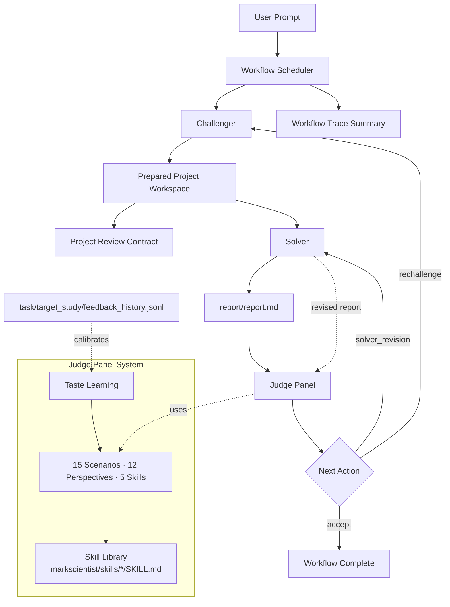
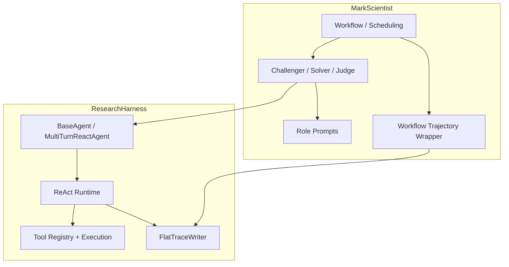

<div align="center">

# 🔬 MarkScientist

**Self-evolving Research Agent with Built-in Scientific Taste**

**Challenger prepares → Solver researches → Judge reviews**

[](LICENSE)
[](https://www.python.org/)
[](https://github.com/black-yt/ResearchHarness)
[](#-how-it-works)
[](#-how-it-works)
[](#-how-it-works)
[](#-architecture-boundary)

</div>

MarkScientist is a higher-layer framework for turning a user request into a **research project workspace**, executing that project, and reviewing both the project definition and resulting report on top of ResearchHarness.

Unlike a standalone execution harness, this project is intentionally centered on:

- Challenger, Solver, and Judge role separation
- project-first research workflows
- review-driven improvement loops
- workflow-level traces layered on top of per-agent harness traces
- higher-level orchestration and evaluation policies
- a CLI that exposes the full research loop across multiple agents

The point is not to replace ResearchHarness. The point is to build a **scientific workflow layer** that reuses the lower-layer runtime while adding project setup, role structure, review pressure, and orchestration logic.

---

## 📚 Table of Contents

- [✨ Highlights](#-highlights)
- [⚡ Quick Start](#-quick-start)
- [🧠 How It Works](#-how-it-works)
- [🗂 Project Model](#-project-model)
- [🧪 Judge Model](#-judge-model)
- [🧭 Architecture Boundary](#-architecture-boundary)
- [💬 Usage](#-usage)
- [📋 Commands](#-commands)
- [⚙️ Config](#️-config)
- [🧪 Testing](#-testing)
- [🪪 License](#-license)

---

## ✨ Highlights

- **Built on ResearchHarness**
  ResearchHarness owns SDK calls, tool calling, and the ReAct loop; MarkScientist owns multi-agent roles and workflow orchestration.
- **Taste learning as a first-class feature**
  Judge standards can be calibrated from a visible workspace feedback log instead of hidden machine-local state.
- **Three-role research loop**
  Challenger prepares the project, Solver performs the research, and Judge scores both the project definition and the resulting report.
- **Project-first execution**
  The workflow is built around a concrete workspace with staged inputs, a public execution package, hidden judge criteria, code, outputs, and `report/report.md`.
- **Review-driven improvement**
  The workflow can iteratively improve outputs based on Judge feedback instead of stopping at one draft.
- **Conditional re-challenge**
  Judge can send the workflow back to Challenger when the project definition itself is too weak, too toy-like, or not grounded in the available inputs, not just when the report is weak.
- **Workflow-level traces**
  MarkScientist preserves per-agent ResearchHarness traces and adds a higher-level workflow summary.
- **Checklist-based judging**
  Judge scores the project and report against an explicit `INSTRUCTIONS.md` task contract and a hidden judge checklist rather than vague style preferences.
- **Scenario-aware Judge policies**
  Judge uses explicit review policies that combine scenario, reviewer perspective, and scoring skill instead of one generic review prompt.
- **Judge skill library**
  The scoring skills are stored as standard markdown skills under `markscientist/skills/*/SKILL.md`, not hard-coded prompt blobs.
- **Multi-reviewer Judge panels**
  Judge simulates multiple specialized reviewers and aggregates them into one final benchmark decision.
- **Visible taste learning**
  `task/target_study/feedback_history.jsonl` keeps calibration inputs inside the project workspace, so score shifts are inspectable and reproducible.

### At a Glance

| Area | What MarkScientist focuses on |
| --- | --- |
| Runtime dependency | Reuses ResearchHarness for execution |
| Roles | Challenger, Solver, Judge |
| Core artifact | A prepared research project workspace |
| Review model | Score, critique, and improve the report |
| Judge system | 15 scenarios × 12 perspectives × 5 skills |
| Skill storage | `markscientist/skills/*/SKILL.md` |
| Taste learning | Visible workspace feedback calibration |
| Trace model | Workflow summary plus per-agent traces |
| UX | Interactive multi-agent CLI |
| Scope | Scientific workflow layer, not execution harness |

## 🚀 Quick Start

```bash
git submodule update --init --recursive
pip install -e .
markscientist
```

`MarkScientist` currently assumes a source checkout with the `ResearchHarness` git submodule available. Wheel-only installs are not a supported standalone distribution mode.

## 🧠 How It Works

`MarkScientist` is not a second execution harness. It is a higher-layer framework built on top of `ResearchHarness`.



The lower-layer execution details live in `ResearchHarness`, and `MarkScientist` connects to them like this:



## 🗂 Project Model

The workflow now separates the Solver-visible execution workspace from Judge-only evaluation materials.

Expected layout:

```text
workspace_root/
  task/
    task_info.json     # private ResearchClawBench-style task contract
    data/              # canonical source data created/curated by Challenger
    related_work/      # canonical real source PDFs created/curated by Challenger
    target_study/
      paper.pdf        # hidden target-study anchor PDF
      checklist.json   # hidden judge rubric
      images/          # optional hidden reference images
      feedback_history.jsonl  # optional visible taste-learning log for judge calibration
  public/
    INSTRUCTIONS.md
    data/              # solver-visible staged subset of task/data/
    related_work/      # solver-visible staged subset of task/related_work/ (starts as PDFs; solver tools may later create local extracted sidecars)
    code/
    outputs/
    report/
      report.md
      images/
```

Role responsibilities:

- `Challenger` works at the private task level and builds the project from scratch when needed: it creates or curates canonical source materials under `task/data/` and `task/related_work/`, writes `task/task_info.json`, writes the hidden `task/target_study/*` assets, and then the harness exports the solver-visible subset into `public/`.
- `task/data/` is for canonical data artifacts only. It should contain datasets or data directories, not literature PDFs. Real PDF references belong under `task/related_work/` or `task/target_study/`.
- Solver-visible related work should come from real source PDFs in `task/related_work/`, or from genuinely downloaded PDFs that Challenger first saves under `task/related_work/` and then stages into `public/related_work/`. Placeholder PDFs or fabricated paper files are not valid project inputs.
- `Solver` works only inside `public/`, performs the research, and must finish with `public/report/report.md`.
- `Judge` evaluates the public deliverables and may additionally read hidden materials under `task/target_study/`.

This separation is intentional: hidden scoring criteria or target answers should never be exposed through the public project files that the Solver can read, but the Challenger is still responsible for constructing the canonical source materials and packaging the full executable project.

## 🧪 Judge Model

The current Judge keeps the simple `Challenger / Solver / Judge` architecture, but its review logic is no longer one flat prompt. It now uses a lightweight policy model:

- **Scenario**: what kind of thing is being judged
- **Perspective**: which specialized reviewer viewpoint to emulate
- **Skill**: which scoring style to emulate

The exact scoring skills are stored as standard markdown skill files:

- `markscientist/skills/judge-geval/SKILL.md`
- `markscientist/skills/judge-prometheus/SKILL.md`
- `markscientist/skills/judge-pairwise/SKILL.md`
- `markscientist/skills/judge-pandalm/SKILL.md`
- `markscientist/skills/judge-judgelm/SKILL.md`

The policy system currently defines 15 built-in Judge scenarios:

| Scenario | What it emphasizes |
| --- | --- |
| `idea_generation` | early research idea quality before project commitment |
| `novelty_check` | differentiation from prior work |
| `project_definition` | grounding, scope, executability, scientific value, non-toy quality |
| `experiment_design` | methodology, controls, and reproducibility before execution |
| `result_analysis` | correctness, interpretation, and uncertainty handling |
| `research_report` | methodology, evidence, results, limitations, reproducibility |
| `claim_validation` | evidence support, claim scope, overclaim risk |
| `ablation_review` | ablation quality and variable isolation |
| `paper_outline` | paper structure and completeness |
| `section_draft` | section-level scientific writing quality |
| `figure_table` | scientific usefulness of figures and tables |
| `rebuttal` | rebuttal responsiveness and evidence use |
| `revision` | whether a revised artifact materially improved |
| `code_review` | code correctness and engineering quality |
| `literature_review` | literature coverage, synthesis, and recency |

The default workflow mainly uses `project_definition` and `research_report`, while the remaining scenarios stay available for stricter or more specialized review passes.

Built-in reviewer perspectives:

| Perspective | Focus |
| --- | --- |
| `senior_reviewer` | overall decision quality |
| `novelty_critic` | originality and overlap with prior work |
| `methods_expert` | design rigor and scope control |
| `statistics_expert` | quantitative validity and uncertainty handling |
| `writing_expert` | clarity, structure, and presentation |
| `domain_expert` | domain-specific technical correctness |
| `literature_expert` | prior work coverage and positioning |
| `code_expert` | implementation correctness and engineering quality |
| `reproducibility_advocate` | artifact completeness |
| `skeptic` | unsupported claims and overclaim detection |
| `area_chair` | balanced final judgment |
| `visualization_expert` | figure and table quality |

Current scoring skills:

| Skill | Style |
| --- | --- |
| `geval` | multi-dimensional rubric scoring |
| `prometheus` | strict criterion-by-criterion grading |
| `pairwise` | before-after comparison |
| `pandalm` | balanced full-artifact evaluation with calibrated tie handling |
| `judgelm` | evidence-heavy judgment and claim scrutiny |

The public workflow currently uses reviewer panels internally:

- project definition panel defaults to `methods_expert × prometheus`, `literature_expert × geval`, and `area_chair × judgelm`
- report panel defaults to `area_chair × judgelm`, `skeptic × geval`, and `reproducibility_advocate × prometheus`
- claim validation remains available as an explicit report-review scenario when a caller chooses it programmatically, and it uses its own panel composition

Taste learning is visible and optional. If `task/target_study/feedback_history.jsonl` exists inside the current project workspace, Judge can apply small score offsets derived from repeated user feedback. Calibrations are keyed by the full reviewer identity (`scenario + perspective + skill`), which keeps different judging modes from contaminating each other. This keeps taste learning inside the workspace instead of relying on hidden machine-local files, and makes every calibration source inspectable by the user.

## 🧭 Architecture Boundary

- `ResearchHarness` is the execution layer:
  - OpenAI-compatible SDK calls
  - native tool calling
  - ReAct loop
  - tool registry and execution
  - flat per-agent trace writing
- `MarkScientist` is the orchestration layer:
  - Challenger / Solver / Judge roles
  - project preparation and workflow scheduling
  - solver/judge improvement loops
  - role-specific prompt addenda
  - workflow-level trajectory summaries

`MarkScientist` agents inherit the ResearchHarness agent base instead of reimplementing the lower-layer execution stack.

## 💬 Usage

### Interactive REPL

```bash
markscientist
```

Default mode runs the full research workflow.

```
[workflow] > Analyze the attached dataset and produce a research report.

╭──────────────── Final Report ────────────────╮
│ # Research Report                            │
│ ...                                          │
╰──────────────────────────────────────────────╯

╭──────────── Workflow Summary ────────────────╮
│ Status      Success                          │
│ Score       75.0/100                        │
│ Iterations  2                                │
╰──────────────────────────────────────────────╯
```

Switch to a single role when needed:

```
[workflow] > /challenger
[challenger] > Prepare a project for reproducing the core claim.

[challenger] > /solver
[solver] > Execute the prepared project and write the report.

[solver] > /judge
[judge] > Score the current report against the hidden judge checklist.
```

### CLI One-Shot Commands

```bash
# Full Challenger -> Solver -> Judge workflow
markscientist "Study whether the benchmark result is reproducible"

# Challenger only
markscientist "Prepare a project for evaluating the dataset" --agent challenger

# Solver only
markscientist "Execute the prepared project" --agent solver

# Judge only
markscientist "Review the current report" --agent judge

# JSON output
markscientist "Review the current report" --agent judge --json
```

### Python API

```python
from pathlib import Path

from markscientist.config import Config, set_config
from markscientist.judging import JudgeScenario
from markscientist.project import ensure_project_layout

config = Config.from_env()
config.workspace_root = Path("./workspace")
set_config(config)

from markscientist.agents import ChallengerAgent, JudgeAgent, SolverAgent
from markscientist.workflow import ResearchWorkflow

paths = ensure_project_layout(config.workspace_root)

challenger = ChallengerAgent(config=config, workspace_root=paths.project_root)
challenger.run("Prepare a research project for the current prompt.", workspace_root=paths.project_root)

solver = SolverAgent(config=config, workspace_root=paths.public_root)
solver_result = solver.run("Execute the prepared project.", workspace_root=paths.public_root)

judge = JudgeAgent(config=config, workspace_root=paths.project_root)
judge_result = judge.review_project_report(
    original_prompt="Review the current report strictly.",
    instructions_text=paths.instructions_path.read_text(encoding="utf-8"),
    checklist_text=paths.judge_checklist_path.read_text(encoding="utf-8"),
    judge_materials_text="",
    report_text=paths.report_path.read_text(encoding="utf-8"),
    report_scenario=JudgeScenario.RESEARCH_REPORT,
    workspace_root=paths.project_root,
)

workflow = ResearchWorkflow(config=config)
workflow_result = workflow.run("Write a research report", workspace_root=config.workspace_root)
print(workflow_result.final_score)
print(workflow_result.metadata["report_path"])
```

## 📋 Commands

```
/help        Show commands       /workflow    Full workflow
/challenger  Challenger mode     /solver      Solver mode
/judge       Judge mode          /model       Switch model
/config      Show config         /clear       New session
/exit        Exit
```

## ⚙️ Config

```bash
# .env
API_KEY=your-key
API_BASE=https://your-openai-compatible-endpoint/v1
MODEL_NAME=gpt-5.4
# SUMMARY_MODEL_NAME=gpt-5.4
SERPER_KEY_ID=your_serper_key
JINA_API_KEYS=your_jina_key
MINERU_TOKEN=your_mineru_token
```

`MarkScientist` reads `API_KEY`, `API_BASE`, and `MODEL_NAME` directly. The extra keys are included because the underlying `ResearchHarness` tool layer may need them when the workflow uses web search, web fetch, or PDF parsing.

Agent runtime defaults and trajectory defaults live in code. Override them programmatically on `Config(...)` when needed.

If you need a non-default workspace root, set `config.workspace_root` before creating agents.

## 🧪 Testing

```bash
PYTHONDONTWRITEBYTECODE=1 pytest -q -p no:cacheprovider tests
```

The test suite checks:

- role agents inheriting the ResearchHarness base agent
- the Challenger -> Solver -> Judge workflow loop
- CLI JSON output and single-agent entry points

## 🪪 License

This project is released under the [MIT License](LICENSE).
